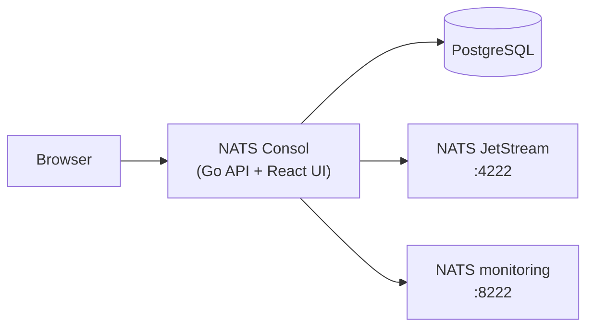

# NATS Consol documentation

Welcome! 👋

**NATS Consol** is a self-hosted web console for **NATS JetStream**. It gives your team one place to browse streams, tail live messages, manage KV/Object stores, and monitor clusters — without opening NATS ports to the public internet.

The browser talks only to the Consol API. The API talks to PostgreSQL (settings & users) and to your NATS clusters on your behalf.

---

## Who is this for?

| You are… | Start here |
|----------|------------|
| **New to the project** — just want it running | [Getting started](./getting-started.md) |
| **App developer / operator** — using the UI day to day | [User guide](./user-guide.md) |
| **DevOps / SRE** — deploying to staging or production | [DevOps setup guide](./devops-setup.md) |
| **Contributor** — hacking on the Go/React codebase | [Developer setup guide](./developer-setup.md) |

---

## What you can do in the UI

- **Dashboard** — JetStream usage and server health at a glance  
- **Clusters** — register many NATS clusters; switch between them in the sidebar  
- **Topology** — visual map of streams and consumers  
- **Supercluster** — routes, gateways, leaf nodes, and replication (read-only view)  
- **Streams & consumers** — create, edit, purge, browse messages, live tail  
- **KV & Object stores** — buckets, keys, and objects  
- **Audit log** — who changed what (admins)  
- **Users & roles** — RBAC and delegated admins (root/admin)  
- **Profiling** — Go runtime profiles for the console server itself (admins, optional)  
- **AI assistant** — JetStream-aware help via Gemini (optional)

---

## Architecture (30-second version)

- **PostgreSQL** stores cluster registrations, users, and audit entries.  
- **NATS client URL** (`nats://…`) is used for JetStream operations.  
- **Monitoring URL** (`http://…:8222`) is used for varz/jsz and supercluster views.

---

## Quick links

- [Main README](../README.md) — feature list, env reference, API summary  
- [OpenAPI spec](../api/openapi.yaml) — full REST API  
- [Docker Compose](../docker-compose.yml) — local full stack  
- [Helm chart](../deploy/helm/nats-consol/) — Kubernetes deployment  

Questions or bugs? Open an issue on [GitHub](https://github.com/gopherust-io/nats-consol).
