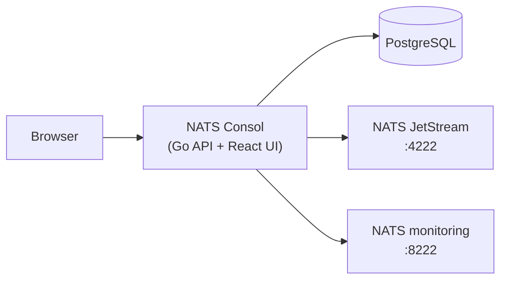

# NATS Consol documentation

Welcome! 👋

**NATS Consol** is a self-hosted web console for **NATS JetStream**. It gives your team one place to browse streams, tail live messages, manage KV/Object stores, and monitor clusters — without opening NATS ports to the public internet.

The browser talks only to the Consol API. The API talks to PostgreSQL (settings & users) and to your NATS clusters on your behalf.

---

## Who is this for?

| You are… | Start here |
|----------|------------|
| **New to the project** — just want it running | [Getting started](./getting-started.md) |
| **App developer / operator** — using the UI day to day | [User guide](./user-guide.md) |
| **DevOps / SRE** — deploying to staging or production | [DevOps setup guide](./devops-setup.md) |
| **Platform lead** — one consol for the whole company | [Company-wide scaling](./company-scale.md) |
| **Contributor** — hacking on the Go/React codebase | [Developer setup guide](./developer-setup.md) |

---

## What you can do in the UI

- **Dashboard** — JetStream usage and server health at a glance  
- **Clusters** — view devops-registered NATS clusters; open from the Clusters card on Systems  
- **Systems** — open a registered system and work inside it  
- **Replicas** — view-only NATS server peers (routes + JetStream meta) for the selected system  
- **Topology** — visual map of streams and consumers
- **Supercluster** — NATS gateway mesh is **not** a first-class UI in 0.11+; operate regions as separate registered clusters and see [Supercluster](./supercluster.md) for behavior and restore checklist
- **Event Catalog** — Swagger-style docs for events (owner, description, JSON Schema, consumers)  
- **Live Architecture** — animated deploy / DDD-layer painting (Docs)  
- **Architecture Review** — event-architecture problems and suggestions (Docs)
- **Architecture Score** — daily 0–100 score, +/- factors, multi-month trend (Docs)
- **Architecture Refactor** — reduce coupling: before/after graphs and migration steps (Docs)
- **Hidden Bottlenecks** — recurring schedule × payload correlations (Docs; not lag/CPU alerts)
- **Chaos Story Generator** — AI invents realistic multi-failure disasters; one-click narrative simulate (Docs; cluster untouched)
- **Architecture Generator** — one-click C4 / Mermaid / PlantUML / Excalidraw / Draw.io / Markdown / ADRs zip (Docs + Topology)
- **Streams & consumers** — create, edit, purge, browse messages, live tail  
- **KV & Object stores** — buckets, keys, and objects  
- **Audit log** — who changed what (admins)  
- **Users & roles** — RBAC and delegated admins (root/admin)  
- **Profiling** — Go runtime profiles for the console server itself (admins, optional)  
- **AI assistant** — JetStream-aware help via Gemini (optional)

---

## Architecture (30-second version)

In the console UI, open **Docs → Live Architecture** (`/docs/live-architecture`) for a living view of services, traffic pulses, and failure ripples. Press **F** for fullscreen; `?scene=layers` shows the DDD package map.

```mermaid
flowchart LR
  Browser --> Console["NATS Consol\n(Go API + React UI)"]
  Console --> PG[(PostgreSQL)]
  Console --> NATS["NATS JetStream\n:4222"]
  Console --> Mon["NATS monitoring\n:8222"]
```

- **PostgreSQL** stores cluster registrations, users, and audit entries.  
- **NATS client URL** (`nats://…`) is used for JetStream operations.  
- **Monitoring URL** (`http://…:8222`) is used for varz/jsz and related health views.

---

## Quick links

- [Main README](../README.md) — feature list, env reference, API summary  
- [OpenAPI spec](../api/swagger.yaml) — REST API (`make openapi`; served at `/api/openapi.yaml`)  
- [Docker Compose](../docker-compose.yml) — local full stack  
- [Local NATS Docker labs](./local-docker.md) — single / cluster / supercluster / auth  
- [Supercluster](./supercluster.md) — Consol vs NATS mesh, operate today, restore checklist  
- [Helm chart](../deploy/helm/nats-consol/) — Kubernetes deployment  

Questions or bugs? Open an issue on [GitHub](https://github.com/gopherust-io/nats-consol).
