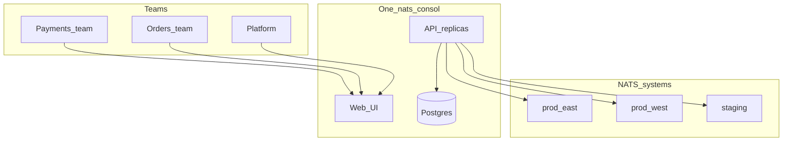

# Scaling NATS Consol for the whole company

Use **one** NATS Consol as a company control plane for many NATS systems and teams. Do **not** run one consol per microservice or project.

---

## What you already have

| Capability | How it works |
|------------|--------------|
| **Many systems** | Unbounded rows in Postgres `clusters` (UI “Systems”); no hard product cap |
| **Team isolation** | `accessRules.clusterIds` + Access grants (`system` / `account` / `nats_user`) |
| **HA** | Stateless app replicas + shared Postgres + shared `SESSION_SECRET` — see [DevOps setup](./devops-setup.md) and the [Helm chart](../deploy/helm/nats-consol/) |

There is **no** organization / project / service object in the product. Map company structure onto **systems + NATS accounts/streams**.

---

## Recommended model

**One production consol + many registered NATS systems.**

| Company concept | Map to consol / NATS |
|-----------------|----------------------|
| Environment / region / critical domain | **System** (cluster row): `prod-east`, `staging`, `payments-prod` |
| Team | Users with `clusterIds` (and optional system/account grants) |
| Microservice | **Streams / KV / subjects** (and NATS accounts on the broker) |
| Platform admins | Root / global admin |
| App operators | Viewer or operator on their systems; JetStream create/update/delete = **admin** or grant-admin |

### Playbook

1. **Deploy once** — Helm, managed Postgres, 2+ consol replicas, strong `ENCRYPTION_KEY` / `SESSION_SECRET` ([DevOps setup](./devops-setup.md)).
2. **Register each NATS deployment** as a system (DevOps: env bootstrap when the registry is empty, then Postgres / ops tooling — cluster CRUD is not exposed as a public product API; see [Connecting to NATS clusters](./devops-setup.md#connecting-to-nats-clusters)).
3. **Invite teams** with scoped `clusterIds` (only systems they own).
4. **Isolate services on NATS** — subject/stream naming (`payments.>`, `orders.>`) and/or real NATS accounts; do not expect consol “projects.”
5. **Tune as systems grow** — `METRICS_SNAPSHOT_INTERVAL=120s`, retention, `DB_MAX_CONNS`; metrics scrapes fan out across clusters (bounded concurrency).

### When to run multiple consols

Only for **separate security domains** (e.g. regulated vs general), different admin roots / encryption keys, or networks that cannot share one consol→NATS path.

Avoid one consol per microservice — high ops cost with little extra isolation if they share the same NATS and Postgres.

---

## Limits to plan around today

- JetStream UI still effectively uses one NATS connection / Default-style account per system — multi-account JetStream in the UI is not fully productized.
- An account **admin** grant allows JetStream manage on that cluster connection; it is not stream-level ACL inside the console.
- Primary login in the user guide is invite + username/password (not first-class company SSO).
- Cluster registry is **ops-managed**, not self-service per app team.

---

## Optional product follow-ups

Not required to go company-wide with the model above:

1. Multi-account JetStream (creds + UI per NATS account)
2. SSO / OIDC as primary login
3. Self-service system registration for platform admins
4. Optional “project” labels grouping systems in the UI

---

## Bottom line

Treat Consol like a Control Plane for **your** fleet: **one console, many systems, RBAC by system, services as streams** — not one console per project.

Related: [User guide — roles](./user-guide.md), [DevOps setup](./devops-setup.md), [Getting started](./getting-started.md).
