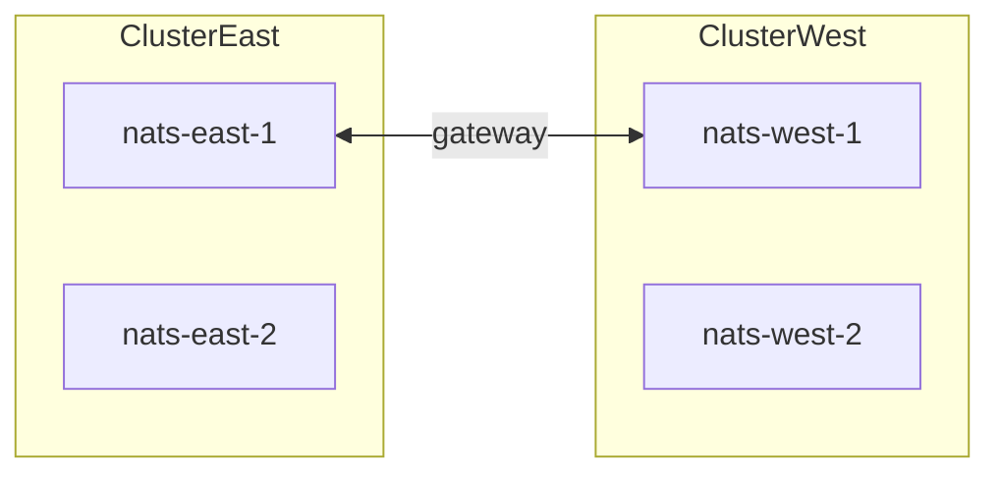

# Local NATS with Docker Compose

Run JetStream locally without installing `nats-server` on the host. Compose files live under [`docker/nats/`](../docker/nats/).

**Not for production:** no TLS (auth lab uses plaintext passwords). Stop the root compose `nats` service before starting these labs when ports overlap (`4222` / `8222`).

## Quick compare

| Mode | Compose file | Client `Address` | Notes |
|------|--------------|------------------|-------|
| Single | [`docker/nats/single`](../docker/nats/single/) | `nats://127.0.0.1:4222` | Everyday Consol / broker |
| Cluster | [`docker/nats/cluster`](../docker/nats/cluster/) | `nats://127.0.0.1:4222,…,nats://127.0.0.1:4226` | `Replicas: 5`, Replicas page |
| Supercluster | [`docker/nats/supercluster`](../docker/nats/supercluster/) | East `4222,4223` or West `4225,4226` | Gateways + JetStream domains |
| Auth (users) | [`docker/nats/auth`](../docker/nats/auth/) | `nats://127.0.0.1:4222` + User/Password | Practice subject AuthZ |

Image: `nats:2.14`. Do not run **cluster** and **supercluster** together (port overlap on `4222`–`4226`). Auth / single also bind `4222` — stop other stacks first.

```bash
make nats-up            # single
make nats-cluster-up    # 5-node
make nats-auth-up       # users + permissions
make nats-down-all      # tear down all lab stacks (-v)
```

---

## Single server

```bash
docker compose -f docker/nats/single/docker-compose.yml up -d
# or: make nats-up
curl -s http://127.0.0.1:8222/healthz
```

Point Consol:

```bash
NATS_URL=nats://127.0.0.1:4222
NATS_MONITORING_URL=http://127.0.0.1:8222
```

Use stream `Replicas: 1`. Monitoring: [http://127.0.0.1:8222](http://127.0.0.1:8222) (`/varz`, `/jsz`, `/healthz`, `/routez`).

---

## 5-node cluster

```bash
make nats-cluster-up
```

- Shared JetStream domain: `hub`
- Host ports: clients `4222–4226`, monitors `8222–8226`
- One named volume per node (`js-n1` … `js-n5`)

```bash
NATS_URL=nats://127.0.0.1:4222,nats://127.0.0.1:4223,nats://127.0.0.1:4224,nats://127.0.0.1:4225,nats://127.0.0.1:4226
NATS_MONITORING_URL=http://127.0.0.1:8222
```

From a Consol container on Docker Desktop, use `host.docker.internal` instead of `127.0.0.1`.

Optional CLI check (if [NATS CLI](https://github.com/nats-io/natscli) is installed):

```bash
nats --server nats://127.0.0.1:4222 server list
```

---

## Mini supercluster (2 × 2)

Two clusters (`east`, `west`), two nodes each, linked by **gateways**. Distinct JetStream domains (`east` / `west`).

```bash
docker compose -f docker/nats/supercluster/docker-compose.yml up -d
```

| Region | Client URLs | Monitor |
|--------|-------------|---------|
| East | `nats://127.0.0.1:4222,nats://127.0.0.1:4223` | `8222`, `8223` |
| West | `nats://127.0.0.1:4225,nats://127.0.0.1:4226` | `8225`, `8226` |

Connect apps to **one** region’s URL list.



---

## Auth lab

```bash
make nats-auth-up
```

Users: `orders-pub` / `pubpass`, `orders-worker` / `workerpass`, `js-admin` / `adminpass`. See [`docker/nats/auth/README.md`](../docker/nats/auth/README.md).

---

## Tear down

```bash
make nats-down-all
# or individually:
docker compose -f docker/nats/single/docker-compose.yml down -v
docker compose -f docker/nats/cluster/docker-compose.yml down -v
docker compose -f docker/nats/supercluster/docker-compose.yml down -v
docker compose -f docker/nats/auth/docker-compose.yml down -v
```

`-v` removes JetStream data volumes.
