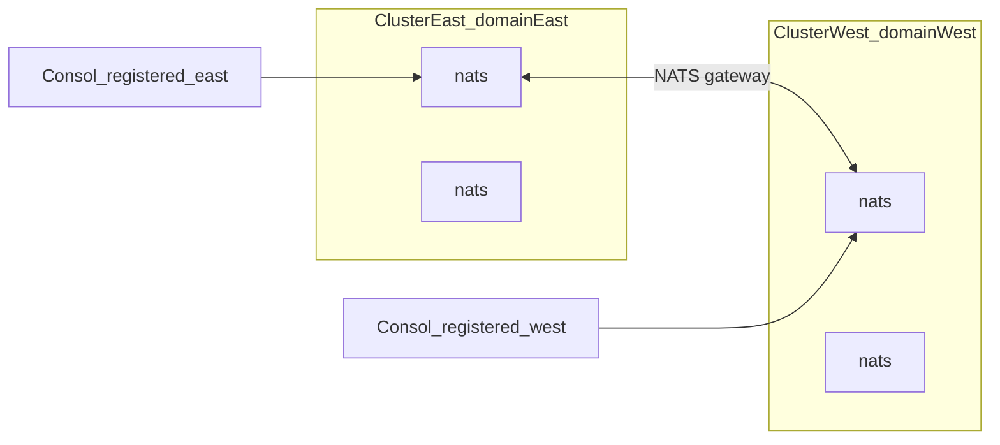

# Supercluster: behavior and required changes

This document explains how a **NATS supercluster** relates to Consol’s **registered clusters**, what the product does today (0.11+), how to operate a multi-region mesh now, and **what must change** when a first-class Supercluster view returns.

For the local 2×2 lab, see [Local NATS Docker labs](./local-docker.md#mini-supercluster-2--2). For company-wide registry mapping, see [Company-wide scaling](./company-scale.md).

---

## Concepts

| Term | Meaning |
|------|---------|
| **Cluster** | One NATS cluster: servers linked by **routes**. Consol **Replicas** shows these peers. |
| **Supercluster** | Two or more clusters linked by **gateways**. Interest and messages may cross the mesh when account/gateway config allows. JetStream usually stays scoped by **domain** unless you set up cross-domain replication. |
| **Consol registered cluster** | One Postgres registry row: one NATS client URL + monitoring URL (+ creds). Consol does **not** auto-discover gateway peers as extra registry entries. |

**Accounts:** Within one Consol connection, accounts are NATS tenants on that deployment. Across two registered clusters they are separate lists unless NATS gateway account config intentionally spans both sides. That is not the same as “two Consol rows share one account table.”

---

## Current product state (0.11+)

A dedicated Supercluster UI/API existed in earlier releases (gateway / route / leaf / stream replication overview). It was **removed in 0.11**. Bookmarks still redirect:

- `/supercluster` → `/admin/topology`
- `/admin/supercluster` → `/admin/topology`

**Topology** is a JetStream stream/consumer inventory map — **not** a gateway mesh view. Do not treat that redirect as Supercluster support.

| Area | Behavior today |
|------|----------------|
| UI | No Supercluster page |
| Topology | Streams / consumers / naming / genome — not gateways |
| Replicas | Intra-cluster peers from `varz` / `routez` / JetStream `meta_cluster` |
| Accounts | Scoped to the **active** registered cluster connection |
| Monitoring proxy | `GET /api/v1/clusters/{id}/monitoring/{endpoint}` still allows `gatewayz`, `routez`, `leafz` |
| Lab | [`docker/nats/supercluster/`](../docker/nats/supercluster/) with JetStream domains `east` / `west` |

---

## How to operate a supercluster today

1. Start the lab ([mini supercluster](./local-docker.md#mini-supercluster-2--2)). Do not run it together with the 5-node cluster lab (shared host ports).
2. Register **east** and **west** as **two** Consol clusters (separate NATS URL lists and monitoring URLs).
3. Use the cluster picker to switch regions. One registration does **not** show the whole mesh.
4. Treat Consol account lists as **per registration**. Gateway-spanning NATS accounts are a broker config concern, not automatic Consol merging.
5. For mesh diagnostics until a UI returns, call monitoring on the active cluster, e.g. `gatewayz` and `leafz` via the monitoring proxy.

**All streams** unions streams from **separately registered** clusters only. It does not invent remote-domain streams that were never scraped under another registration.

---

## Change checklist — when Supercluster appears again

These items are **required** for the feature to work as operators expect. They are not optional polish.

1. **Restore mesh overview API + page**  
   Scrape `varz`, `gatewayz`, `routez`, `leafz`, and `jsz` (raft / streams / config) for the selected registration. Show gateway links, leaf nodes, JetStream meta, and stream mirror/source replication (parity with pre-0.11 `BuildSuperclusterOverview`).

2. **Stop misleading redirects**  
   `/supercluster` (and `/admin/supercluster`) must open the mesh view, not Topology. Add a nav label distinct from **Topology** and **Replicas**.

3. **Multi-registration linking**  
   Keep documenting “register each region,” **or** add discovery that maps outbound gateway names to other Consol cluster IDs when those peers are already registered.

4. **JetStream `domain`**  
   Surface domain on cluster status. Add `domain` (and external API where needed) on stream source/mirror DTOs and UI so cross-domain replication is visible and configurable.

5. **Accounts clarity**  
   UI copy and Access should state that account isolation is per NATS connection/deployment. Call out gateway-spanning accounts explicitly when NATS is configured that way — do not imply two Consol clusters share one account list.

6. **Replicas vs Supercluster**  
   Keep **Replicas** = intra-cluster peers (routes + meta). Keep **Supercluster** = gateways + leafs + cross-domain replication. Do not merge the pages.

7. **CHANGELOG and guides**  
   Note the 0.11 removal when documenting restoration. Update the [user guide](./user-guide.md) and [docs README](./README.md) feature lists.

8. **Lab DX**  
   Add `make nats-supercluster-up` (or keep compose-only but document next to cluster lab targets in the Makefile / [local Docker](./local-docker.md)).

9. **OpenAPI**  
   Document `GET …/supercluster` (or successor). Promote `gatewayz` / `leafz` in docs if they become first-class beyond the raw monitoring proxy.

10. **Tests**  
    API fixtures for `gatewayz` / `leafz` parsing; UI smoke for the mesh page; redirect tests that fail if Supercluster points at Topology again.

---

## Non-goals

- Consol does **not** replace NATS server config for gateways, accounts, or JetStream domains.
- One Consol connection still JetStream-operates whatever that client can reach; the registry remains **one connection per registered cluster**.
- Restoring Supercluster does not by itself productize full multi-account JetStream admin (see [company-scale limits](./company-scale.md#limits-to-plan-around-today)).

---

## Related

- [Local NATS Docker labs](./local-docker.md) — bring up east/west  
- [Company-wide scaling](./company-scale.md) — map regions to registered clusters  
- [User guide](./user-guide.md) — Replicas and Topology (not mesh)  
- [DevOps setup](./devops-setup.md) — registering NATS deployments  
